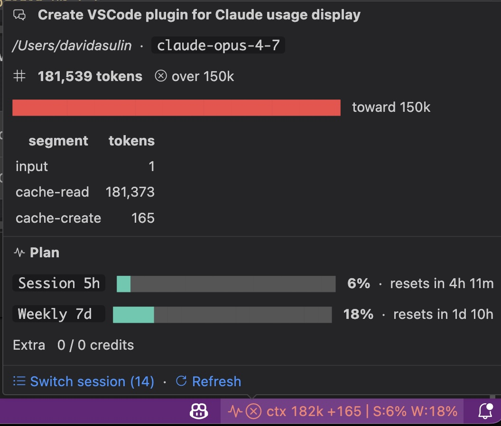

# Claude Code Context & Usage — VS Code Extension

Shows your live Claude Code context-window usage and your plan limits in the
status bar. Designed for people who run several Claude Code chat tabs in the
native VS Code extension at once and want to see at a glance which one is
about to fill its context.



## What it shows

**Status bar:** `$(pulse) ctx 137k +12k │ S:3% W:18%`

- `ctx 137k` — current context size for the active chat (exact, read from
  the same `usage` field the API returned)
- `+12k` — delta vs. the previous turn (only shown when meaningful)
- `S:3% W:18%` — your Claude Code 5h and 7d plan utilization

The token count tints **yellow at 100k** and **red at 150k**, with a
matching `$(warning)`/`$(error)` icon prefix.

**Hover tooltip:**
- Session title (the same AI-generated title shown in Claude Code's chat
  history panel)
- Context size with a colored progress bar relative to the danger threshold
- Per-segment token breakdown (input · cache-read · cache-create)
- Plan-usage bars with reset times
- Quick links to switch session, unpin, refresh

## How it works (technical, in one paragraph)

The extension reads Claude Code's own session transcripts at
`~/.claude/projects/{slug}/{sessionId}.jsonl` and replicates the **exact**
formula `/context` uses internally: it scans backwards for the most recent
non-synthetic `assistant` message, then sums
`input_tokens + cache_creation_input_tokens + cache_read_input_tokens` —
identical to Claude Code's own [`getCurrentUsage`](https://github.com/anthropics/claude-code)
and `analyzeContextUsage` code paths. Plan usage comes from the OAuth
endpoint `api.anthropic.com/api/oauth/usage`, authenticated with the same
token Claude Code stores locally (macOS Keychain, or `~/.claude/.credentials.json`).
Active sessions are enumerated from `~/.claude/sessions/*.json` (filtered to
live PIDs); titles come from the transcript's `ai-title` lines. All reads
are local — the only network call is the OAuth usage endpoint, throttled to
once every 2 minutes.

## Install

### From GitHub Release (recommended)

1. Go to [Releases](../../releases) and download the latest `.vsix`.
2. In VS Code: **Extensions** view → `…` menu → **Install from VSIX…**
3. Pick the downloaded `.vsix`.

### From source

```bash
git clone <this-repo>
cd claude-context-status
npm install
npm run compile
# Open the folder in VS Code and press F5 to launch in an Extension Dev Host
```

## Settings

### How to open the settings UI

Any of these will open VS Code's normal Settings UI, pre-filtered to this
extension — so you can tweak thresholds, display mode, etc. with sliders and
dropdowns instead of editing JSON:

- **From the status bar:** hover the `ctx …` indicator and click **⚙ Settings** at the bottom of the tooltip.
- **Command Palette** (`Cmd/Ctrl+Shift+P`): run `Claude Context: Open Settings`.
- **Manually:** open Settings (`Cmd/Ctrl+,`) and type `claudeContext` in the search box, or paste `@ext:davidas1.claude-context-status` to see only this extension's settings.

If you'd rather edit JSON directly, the keys live under `claudeContext.*` in
your user `settings.json`.

### Available settings

| Setting | Default | What it does |
|---|---|---|
| `claudeContext.contextDisplay` | `tokens` | `tokens`, `percent`, or `both` |
| `claudeContext.contextLimit` | `200000` | Denominator for percent display (set to `1000000` for 1M-context models) |
| `claudeContext.warnAtTokens` | `100000` | Yellow tint + warning icon at this count |
| `claudeContext.dangerAtTokens` | `150000` | Red tint + error icon at this count |
| `claudeContext.showPlanUsage` | `true` | Show the `/usage` plan bars alongside context |
| `claudeContext.refreshIntervalSeconds` | `5` | Fallback poll rate (file-watcher handles real-time updates) |
| `claudeContext.usageRefreshIntervalSeconds` | `120` | How often to poll the plan-usage endpoint |

## Commands

- **Claude Context: Switch Tracked Session** — pick from all live sessions
- **Claude Context: Unpin (auto-pick most recent)** — return to following whichever session is most active
- **Claude Context: Refresh Now** — force-refresh plan usage
- **Claude Context: Open Settings** — jump to VS Code's settings UI for this extension

## Caveats

- **1M context window opt-in isn't detectable from disk.** Claude Code stores
  the bare model string in the transcript (e.g. `claude-opus-4-7`), not the
  `[1m]` suffix. If you run the 1M variant, set `claudeContext.contextLimit`
  to `1000000` so percent display is accurate. **Token counts are always
  exact regardless.**
- **The plan-usage endpoint is undocumented.** The extension uses the same
  endpoint Claude Code itself uses for its `/usage` command. If Anthropic
  changes it, that section of the tooltip will go blank until the extension
  is updated.
- **No data leaves your machine** beyond the one OAuth call to
  `api.anthropic.com`. All session/context reads are local files.

## License

MIT
